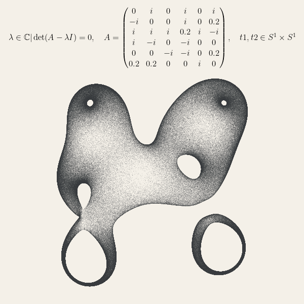
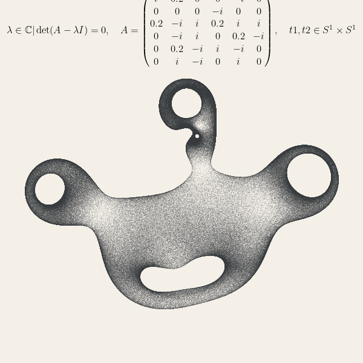

# EigenTorusVisualizer

**EigenTorusVisualizer** è un progetto Python che consente di visualizzare gli autovalori di matrici complesse generate casualmente. Utilizzando il concetto di configurazioni casuali sul toro, il programma calcola e visualizza gli autovalori delle matrici in un grafico scatter.


## Come funziona il codice

Il file `eigen.py` contiene una classe chiamata `Eigenfish`, che è responsabile della creazione di una matrice complessa e della successiva calcolazione dei suoi autovalori. Il processo è suddiviso in tre passi principali:

1. **Inizializzazione**: Viene creata una matrice complessa di dimensioni specificate e vengono scelti casualmente degli indici variabili per la matrice.
2. **Calcolo degli autovalori**: Il metodo `eigvals_random_ts_torus` calcola gli autovalori della matrice modificata da configurazioni casuali sul toro.
3. **Visualizzazione**: Gli autovalori sono visualizzati in un grafico scatter, con un titolo generato in LaTeX che descrive la matrice utilizzata.



## Come eseguire il programma

1. Clona questa repository:
   ```bash
   git clone https://github.com/tuo-username/EigenTorusVisualizer.git
   ```
2. Installa le dipendenze richieste:
   ```bash
   pip install numpy matplotlib
   ```
3. Esegui il file `eigen.py` per generare un grafico degli autovalori:
   ```bash
   python eigen.py
   ```
4. Il programma genererà un grafico scatter degli autovalori che puoi visualizzare.

## Personalizzazione

Il codice è altamente configurabile. Ecco alcune delle possibili modifiche:

- **Modificare le dimensioni della matrice**: Cambia il valore della variabile `mdim` per creare matrici di dimensioni diverse.
- **Cambiare il numero di configurazioni casuali**: Modifica `n_matrix` per aumentare o diminuire il numero di configurazioni sul toro.
- **Personalizzare il grafico**: Puoi cambiare il colore dello sfondo del grafico modificando `fig.set_facecolor("#f4f0e8")` con un altro colore a tua scelta.
- **Modificare lo stile e il colore degli autovalori**: Personalizza i colori e lo stile degli autovalori cambiando i parametri di `ax.scatter`.



