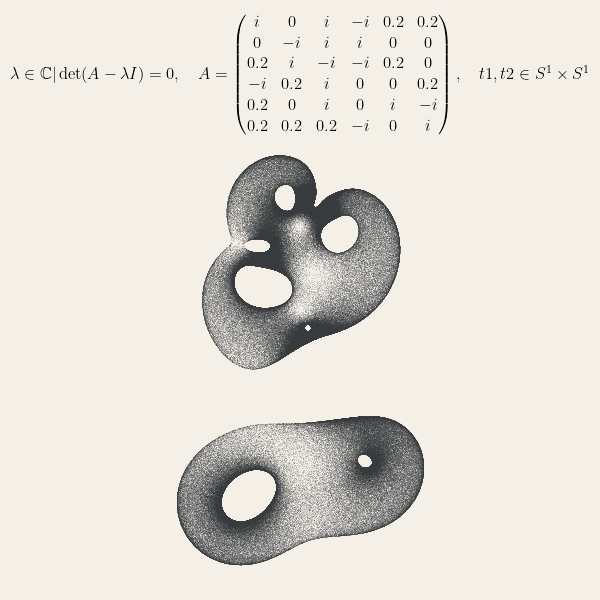

# EigenTorusVisualizer

**EigenTorusVisualizer** è un progetto Python che consente di visualizzare gli autovalori di matrici complesse generate casualmente. Utilizzando il concetto di configurazioni casuali sul toro, il programma calcola e visualizza gli autovalori delle matrici in un grafico scatter.



## Come funziona il codice

Il file `eigen.py` contiene una classe chiamata `Eigenfish`, che è responsabile della creazione di una matrice complessa e della successiva calcolazione dei suoi autovalori. Il processo è suddiviso in tre passi principali:

1. **Inizializzazione**: Viene creata una matrice complessa di dimensioni specificate e vengono scelti casualmente degli indici variabili per la matrice.
2. **Calcolo degli autovalori**: Il metodo `eigvals_random_ts_torus` calcola gli autovalori della matrice modificata da configurazioni casuali sul toro.
3. **Visualizzazione**: Gli autovalori sono visualizzati in un grafico scatter, con un titolo generato in LaTeX che descrive la matrice utilizzata.


## Come eseguire il programma

1. Clona questa repository:
   ```bash
   git clone https://github.com/tuo-username/EigenTorusVisualizer.git
   ```
2. Installa le dipendenze richieste:
   ```bash
   pip install numpy matplotlib
   ```
3. Esegui il file `eigen.py` per generare un grafico degli autovalori:
   ```bash
   python eigen.py
   ```
4. Il programma genererà un grafico scatter degli autovalori che puoi visualizzare.

## Personalizzazione

Il codice è altamente configurabile. Ecco alcune delle possibili modifiche:

- **Modificare le dimensioni della matrice**: Cambia il valore della variabile `mdim` per creare matrici di dimensioni diverse.
- **Cambiare il numero di configurazioni casuali**: Modifica `n_matrix` per aumentare o diminuire il numero di configurazioni sul toro.
- **Personalizzare il grafico**: Puoi cambiare il colore dello sfondo del grafico modificando `fig.set_facecolor("#f4f0e8")` con un altro colore a tua scelta.
- **Modificare lo stile e il colore degli autovalori**: Personalizza i colori e lo stile degli autovalori cambiando i parametri di `ax.scatter`.


## Sezione Matematica Approfondita

Il concetto principale utilizzato in questo programma è il calcolo degli autovalori di una matrice. Approfondiamo alcuni aspetti matematici.

### Definizione di Autovalore

Dato un operatore lineare \( A \) su uno spazio vettoriale \( V \), un numero \( \lambda \in \mathbb{C} \) è detto **autovalore** di \( A \) se esiste un vettore non nullo \( v \in V \) tale che:
$$
A v = \lambda v
$$
dove \( v \) è detto **autovettore** associato a \( \lambda \).

In altre parole, un autovalore è una scala di fattore per la quale l'applicazione dell'operatore \( A \) su un vettore \( v \) non cambia la direzione del vettore, ma solo la sua magnitudine.

### Toro

Il toro \( S^1 \times S^1 \) è uno spazio topologico che rappresenta un prodotto cartesiano di due cerchi. Può essere visualizzato come una superficie chiusa e senza bordo, simile a una ciambella. Nel contesto di questo programma, le configurazioni casuali sul toro sono utilizzate per generare valori per gli indici variabili della matrice.

Il toro ha proprietà interessanti che lo rendono utile in molte aree della matematica e della fisica, soprattutto in contesti dove le condizioni al contorno sono periodiche.

### Determinante e Polinomio Caratteristico

Per calcolare gli autovalori di una matrice \( A \), si risolve l'equazione:
$$
\det(A - \lambda I) = 0
$$
dove \( \lambda \) rappresenta gli autovalori cercati, \( I \) è la matrice identità e \( \det \) denota il determinante della matrice.

Questa equazione è nota come **equazione caratteristica** di \( A \) e il polinomio ottenuto espandendo il determinante è chiamato **polinomio caratteristico**. Gli autovalori sono le radici di questo polinomio. Poiché il determinante è una funzione complessa, le soluzioni (autovalori) possono essere numeri complessi, e quindi vengono rappresentate nel piano complesso.

### Visualizzazione degli Autovalori

Gli autovalori di una matrice complessa sono punti nel piano complesso. Il programma visualizza questi autovalori in un grafico scatter, dove l'asse orizzontale rappresenta la parte reale e l'asse verticale rappresenta la parte immaginaria degli autovalori.

Il titolo del grafico è generato utilizzando LaTeX per fornire una rappresentazione matematica precisa della matrice e del contesto in cui vengono calcolati gli autovalori.

## Note

Questa repository non solo offre una comprensione visiva degli autovalori di matrici complesse, ma può essere estesa per esplorare ulteriormente la teoria degli operatori lineari e la loro applicazione nella fisica quantistica e nella teoria dei sistemi dinamici.
